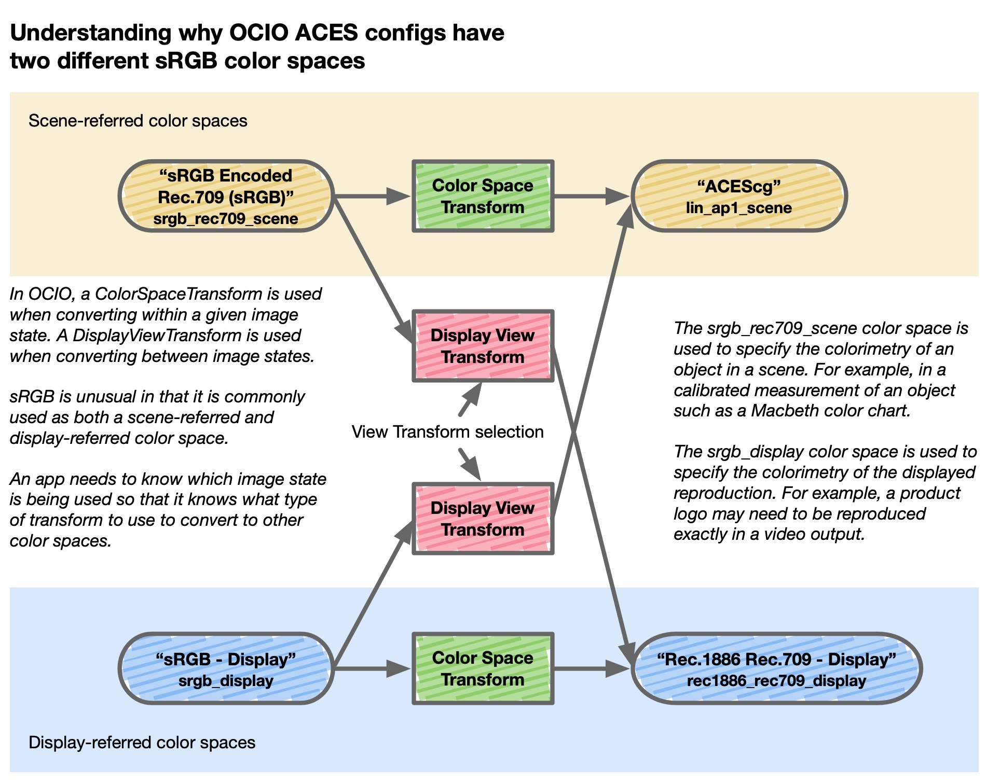

## Color Space Encodings for Texture Assets and CG Rendering

**ASWF Color Interop Forum Recommendation** 

*2024-10-07 v1.0 FINAL2024-09-19 draft*

### Introduction

The Academy Software Foundation and related organizations such as the Alliance for OpenUSD are developing open source software components for computer graphics and related fields. Several of these projects have found a need to identify a color space encoding as an attribute of an object. In order to enable improved interop among projects, the ASWF Color Interop Forum is making this recommendation of a core set of color spaces to be used for computer graphics.

It's important to note that this set of color spaces is intended to be only the "core" or "minimum" set of color spaces that should be supported for a satisfactory level of interop. As these open source projects are used in domains outside the film VFX and animation community where they originated, other existing color space encodings will become more relevant. Furthermore, new color space encodings are constantly being developed. Therefore, it is highly recommended that projects support the ability to define and interchange custom color space encodings.

### Technical Background Information for the Recommendations

#### Image State

Modern color management (e.g. ACES, OpenColorIO) is based on the notion of Image State as defined in ISO standard 22028-1. In summary, this draws a distinction between color space encodings that are scene-referred and those that are output-referred (also known as display-referred). A scene-referred color space encoding encodes the colorimetry of an object in a scene. A display-referred color space encoding encodes the colorimetry of a reproduction of a scene. Because the human visual system is adaptive, its response varies greatly based on such variables as absolute levels of illumination, viewing environment, and other factors. Therefore, successful image reproduction requires more than simply sending colorimetry, other information is required. The Image State is an attempt to communicate some of this additional essential contextual information.

In computer graphics, it is well-known that rendering calculations should be accomplished in a linear color space. Although there are both display-linear and scene-linear color space encodings, it is best-practice to use scene-linear encodings for computer graphics. For example, the Academy Color Encoding System recommends the ACEScg color space for this purpose. 

The recommendations herein only contain scene-referred color space encodings since it is essential that all of them may be converted into a suitable rendering color space with a minimal amount of computation.

It is important to recognize that some of the color space encodings recommended herein are based on more standardized versions of these color spaces that are actually display-referred. For example, sRGB has been standardized as IEC 61966-2-1:1999. This is a display-referred color space, as one would expect for a standard for displaying colors on a monitor. However, in computer graphics, the sRGB mathematical formula is commonly used directly on scene-referred values, resulting in a non-standard variant of sRGB.

#### White Points

Illuminants in the real world exist along a continuum of white points, for example, from candlelight to skylight in open shade. Similarly, display devices use a range of white points from the D65 of television to the warmer whites traditionally used in cinema projection to the even warmer whites used in the graphics arts industry. However, successful image reproduction generally requires that color management applies some kind of adaptation (similar to that performed by the human visual system) so that the viewed images do not seem to have a color cast in the context of where they are viewed.

In the present recommendation, most of the color space encodings are using either a D65 or D60 white point. Therefore it is necessary for a chromatic adaptation be performed so that conversions map neutrals to neutrals, without any color cast. In the field of color science, many algorithms have been proposed for chromatic adaptation. However, given the need for successful interop across a wide number of systems and implementations, consistency is probably more important than chasing the latest algorithm. This is especially true given the relatively small amount of adaptation required between D60 and D65. Hence, the recommendation is to use a simple von Kries adaptation using Bradford cone primaries. This is the method that has the best compatibility with both ACES and ICC color management.

For all of the color space encodings recommended in this document other than CIE XYZ, neutral objects are represented with equal RGB values, regardless of the associated white point colorimetry. This facilitates using the RGB values in various software applications where that property is assumed. (For CIE XYZ, equal XYZ values must always correspond to illuminant E, so in that case neutrals have the chromaticity of D65.)

As an aside, it may be helpful to clarify that the D65 color spaces used herein use the exact numeric chromaticities from the ITU specifications {x \= 0.3127, y \= 0.3290}, which is slightly different from what one may calculate from the CIE daylight standards. Similarly, the D60 chromaticities are from the ACES standards {x= 0.32168, y \= 0.33767}, even though they [differ ever so slightly](https://docs.acescentral.com/tb/white-point) from a strict interpretation of the CIE equations. Implementers should use the values specified here rather than trying to swap in "better" values they derive through other means.

#### Integer Encodings

RGB images are often stored as integers in file formats. However, since computer graphics rendering calculations are performed with floating-point values, there must be a conversion. Since linear values must have a non-linear transfer function applied to be stored accurately in an integer encoding, the conversion to a floating-point space for rendering is often done by a color management system which will not only linearize, but also convert to the desired color primaries.

The recommendations below do not deal with integer encodings. It is assumed that integer values have been normalized to a floating-point representation by dividing by (2^N \- 1), where N is the bit-depth. For example, eight-bit integer values would be normalized by dividing by 255 and 16-bit values would be normalized by dividing by 65535\.

#### Handling Values Outside \[0,1\]

Implementations of these color space encodings should be able to accept values outside the normalized floating-point domain of 0\. to 1\. Values above 1 are very common when dealing with scene-referred color spaces and may be interpreted to mean that an object is producing or reflecting more light than a perfectly diffuse reflecting white material. Negative values indicate that the color is outside the gamut of the primaries.

Handling these values for the linear color spaces is straight-forward. But for the non-linear ones, care must be taken regarding the transfer function. For values greater than 1, the formula for the transfer function should simply be evaluated with the larger value. For example, if the transfer function is a power function, simply evaluate the power function with the value greater than 1\. 

The recommendation for negative values is dependent on the transfer function. For power functions, the slope at 0 is infinite. Therefore the recommendation is to pass through the negative values unchanged. For transfer functions that use a linear segment that goes through the origin, the recommendation is to simply multiply the negative value by the slope at the origin.

### OpenColorIO Reference Implementation

An OpenColorIO config file is provided as part of this recommendation that serves as a reference implementation for how to convert among the color spaces. OpenColorIO provides a maximum of single-precision (32-bit float) pixel processing. However, the matrix coefficients and other parameters in the config file are calculated at double-precision and so may be used as a reference source for higher precision processing.

Because OCIO is oriented towards high-performance image processing, there are a number of speed vs. quality tradeoffs that are available. By default, the library uses a fast approximation of an exact power function and that will slightly affect the conversions between some of these color spaces. Hence, implementers verifying numerical results should set the following environment variable to turn off any optimizations:

    export OCIO_OPTIMIZATION_FLAGS=0

Note that the library reads this environment variable directly and so generally works even when OCIO is embedded in other applications.

### Components specified as part of the Color Space Recommendations

The following pieces of information are provided for each color space:

| Component | Description |
| :---- | :---- |
| Name | This is the full name of the color space. It is recommended as the user-facing text that should be used in software user interfaces. For example, these are the names that users would see in the color space menus of an application that uses OpenColorIO. |
| Compact Name | This is a shorter name that is intended to be used in file formats. These are constructed so that they are also suitable for use in file paths or as arguments to command-line tools or scripts. In the context of OpenColorIO, these are referred to as "aliases" for the full name but do not appear in user-facing menus. |
| Transfer Function | The transfer function is the non-linearity that is applied to the RGB values relative to a linear representation. Values are described as "linear" if they are proportional to light energy in the scene. A doubling of a linear value is equivalent to an increase of one photographic "stop". For non-linear transfer functions, the description provided is for the function to convert the non-linear encoding to a linear encoding (i.e., the EOTF). |
| Primaries | The color primaries are the CIE 1931 xy chromaticity coordinates for red, green, and blue. The linear RGB values are tristimulus values in the specified coordinates. Positive RGB values define the gamut for those primaries. Note that since the linear color spaces are expected to be represented using floating-point numbers, colors outside the gamut of the primaries may be represented using a negative value for one or more of R, G, or B. However, since negative values tend to be problematic in CG rendering calculations, it is customary to only use positive values. |
| White Point | The CIE 1931 xy chromaticity coordinates that the primaries are normalized to. This defines the white point of the viewing environment that the observer is adapted to. |
| Image State | The image state of the color space encoding, as defined in ISO 22028-1. |
| Rendering Space | This indicates whether the color space encoding is commonly used as a computational space for performing computer graphics rendering computations. Spaces for which this item is "No" are intended primarily for storage of CG assets such as textures. |
| Basic | While this document recommends that implementers support all of the color spaces documented here, it is recognized that the full list may be overwhelming to some users who may struggle with which option to choose. Therefore, a few color spaces are singled out as being especially essential for novice users. This shorter list may, for example, be used if an application wants to present a shorter list of menu options when creating new assets. |
| Notes | Historically, there has been confusion around the implementation of several of these color spaces. This document tries to provide some additional notes and background information which implementers may find useful. |
| References | This includes a reference to official standards, where they exist, or other official documents that describe properties of the color space encoding, such as the color primaries. |

## Color Space Recommendations for Texture Assets and CG Rendering

#### Summary Table — Overview of the Recommendations

| Name | Compact Name | Transfer Function | Primaries | White Point | Image State |
| :---- | :---- | :---- | :---- | :---- | :---- |
| ACEScg | lin\_ap1\_scene | Linear | AP1 | D60 | Scene-referred |
| ACES2065-1 | lin\_ap0\_scene | Linear | AP0 | D60 | Scene-referred |
| Linear Rec.709 (sRGB) | lin\_rec709\_scene | Linear | Rec.709 | D65 | Scene-referred |
| Linear P3-D65 | lin\_p3d65\_scene | Linear | DCI-P3 | D65 | Scene-referred |
| Linear Rec.2020 | lin\_rec2020\_scene | Linear | Rec.2020 | D65 | Scene-referred |
| Linear AdobeRGB | lin\_adobergb\_scene | Linear | AdobeRGB | D65 | Scene-referred |
| CIE XYZ-D65 \- Scene-referred | lin\_ciexyzd65\_scene | Linear | XYZ 1931 | D65 | Scene-referred |
| sRGB Encoded Rec.709 (sRGB) | srgb\_rec709\_scene | sRGB | Rec.709 | D65 | Scene-referred |
| Gamma 2.2 Encoded Rec.709 | g22\_rec709\_scene | 2.2 power | Rec.709 | D65 | Scene-referred |
| Gamma 1.8 Encoded Rec.709 | g18\_rec709\_scene | 1.8 power | Rec.709 | D65 | Scene-referred |
| sRGB Encoded AP1 | srgb\_ap1\_scene | sRGB | AP1 | D60 | Scene-referred |
| Gamma 2.2 Encoded AP1 | g22\_ap1\_scene | 2.2 power | AP1 | D60 | Scene-referred |
| sRGB Encoded P3-D65 | srgb\_p3d65\_scene | sRGB | DCI-P3 | D65 | Scene-referred |
| Gamma 2.2 Encoded AdobeRGB | g22\_adobergb\_scene | \~2.2 power | AdobeRGB | D65 | Scene-referred |
| Data | data | n/a | n/a | n/a | n/a |
| Unknown | unknown | n/a | n/a | n/a | n/a |

#### Linear Color Space Encodings

| Name | ACEScg |
| :---- | :---- |
| Compact Name | lin\_ap1\_scene |
| Transfer Function | Linear |
| Primaries | AP1 – R {x: 0.713, y: 0.293}, G {x: 0.165, y: 0.830}, B {x: 0.128, y: 0.044} |
| White Point | D60 – {x: 0.32168, y: 0.33767} |
| Image State | Scene-referred |
| Rendering Space | Yes |
| Basic | Yes |
| Notes | The ACEScg color space encoding has a wide gamut that has been shown to work well as the computational space for computer graphics rendering. It is thoroughly documented on the ACES website. |
| References | https://docs.acescentral.com/specifications/acescg/ |

| Name | ACES2065-1 |
| :---- | :---- |
| Compact Name | lin\_ap0\_scene |
| Transfer Function | Linear |
| Primaries | AP0 – R {x: 0.7347, y: 0.2653}, G {x: 0.0, y: 1.0}, B {x: 0.0001, y: –0.0770} |
| White Point | D60 – {x: 0.32168, y: 0.33767} |
| Image State | Scene-referred |
| Rendering Space | No |
| Basic | Yes |
| Notes | The ACES2065-1 color space encoding has a very wide gamut that allows all colors to be represented with only positive values. It is the reference space of the Academy Color Encoding System (ACES). It is thoroughly documented in SMPTE standard ST 2065-1. It is a bit too wide a gamut to use as a rendering space, but it is an excellent space for storing textures in OpenEXR files, as documented in SMPTE ST 2065-4. |
| References | https://doi.org/10.5594/SMPTE.ST2065-1.2021 |

| Name | Linear Rec.709 (sRGB) |
| :---- | :---- |
| Compact Name | lin\_rec709\_scene |
| Transfer Function | Linear |
| Primaries | Rec.709 – R {x: 0.640, y: 0.330}, G {x: 0.300, y: 0.600}, B {x: 0.150, y: 0.060} |
| White Point | D65 – {x: 0.3127, y: 0.3290} |
| Image State | Scene-referred |
| Rendering Space | Yes |
| Basic | Yes |
| Notes | This is probably still the most commonly used CG rendering space. However, it is a small gamut which means it is not possible to represent certain colorful objects with only positive RGB values. This is problematic for rendering since negative values cause computational problems. It is recommended that the industry move to wider gamut color spaces such as ACEScg for rendering. |
| References | There is no color space encoding specification, but the primaries may be found in: https://www.itu.int/rec/R-REC-BT.709 |

| Name | Linear P3-D65 |
| :---- | :---- |
| Compact Name | lin\_p3d65\_scene |
| Transfer Function | Linear |
| Primaries | DCI-P3 – R {x: 0.680, y: 0.320}, G {x: 0.265, y: 0.690}, B {x: 0.150, y: 0.060} |
| White Point | D65 – {x: 0.3127, y: 0.3290} |
| Image State | Scene-referred |
| Rendering Space | Yes |
| Basic | Yes |
| Notes | This is not as good a rendering space as ACEScg, but it is better than Linear Rec.709 since it has a bigger gamut. It may be easier for artists to use than ACEScg since most modern monitors are able to show almost all of the DCI-P3 gamut, which is not true for ACEScg. |
| References | There is no color space encoding specification, but the primaries were standardized as the minimum gamut of the Digital Cinema Initiatives reference projector, which has been standardized in SMPTE RP 431-2: https://pub.smpte.org/pub/rp431-2/rp0431-2-2011.pdf |

| Name | Linear Rec.2020 |
| :---- | :---- |
| Compact Name | lin\_rec2020\_scene |
| Transfer Function | Linear |
| Primaries | Rec.2020 – R {x: 0.708, y: 0.292}, G {x: 0.170, y: 0.797}, B {x: 0.131, y: 0.046} |
| White Point | D65 – {x: 0.3127, y: 0.3290} |
| Image State | Scene-referred |
| Rendering Space | Yes |
| Basic | No |
| Notes | This is a gamut that is very similar to ACEScg and thus makes a good rendering color space, though it is not often used for that purpose. The primaries are on the spectrum locus and therefore most monitors are unable to display the entire gamut. |
| References | There is no color space encoding specification, but the primaries may be found in: https://www.itu.int/rec/R-REC-BT.2020 |

| Name | Linear AdobeRGB |
| :---- | :---- |
| Compact Name | lin\_adobergb\_scene |
| Transfer Function | Linear |
| Primaries | AdobeRGB – R {x: 0.640, y: 0.330}, G {x: 0.210, y: 0.710}, B {x: 0.150, y: 0.060} |
| White Point | D65 – {x: 0.3127, y: 0.3290} |
| Image State | Scene-referred |
| Rendering Space | No |
| Basic | No |
| Notes |  |
| References | There is no color space encoding specification. |

| Name | CIE XYZ-D65 \- Scene-referred |
| :---- | :---- |
| Compact Name | lin\_ciexyzd65\_scene |
| Transfer Function | Linear |
| Primaries | CIE XYZ 1931 – R {x:1., y:0.}, G {x:0., y:1.}, B {x:0., y:0.} |
| White Point | D65 – {x: 0.3127, y: 0.3290} |
| Image State | Scene-referred |
| Rendering Space | No |
| Basic | No |
| Notes | This space is not recommended for storing images. It is provided because there are many situations in computer graphics where the goal is to simulate some natural phenomena that are described by models or data that involves CIE colorimetry such as physical sky models, daylight or blackbody curves, spectral material models, diffraction effects, etc. When such data is used, this color space provides a bridge to convert it into one of the other color space encodings.    Numerically, this color space is simply CIE 1931 XYZ tristimulus values. It is normalized so that X=Y=Z aligns with CIE illuminant E. However, the reference viewing environment's adaptive white point (i.e., the white point that the observer is adapted to) is CIE D65. Therefore, the chromaticity coordinate that will map to R=G=B (in other words, a neutral) in any of the other color spaces in this document is {x: 0.3127, y: 0.3290}.    For example, if a physical sky model is being used to generate XYZ values in this color space and they are then converted to one of the other color spaces in this document, the model will need to produce D65 in order to obtain a neutral. If the input is a color temperature from the blackbody locus, no value will produce a neutral since that locus does not pass through the chromaticity for CIE daylight illuminant D65. In that case, an additional chromatic adaptation to D65 might be warranted before encoding in this color space so that a chosen color temperature will result in R=G=B.    This color space encoding is very similar to ACES2065-1 and so most of SMPTE ST 2065-1 applies equally here. But there are two differences: the RGB primaries are CIE 1931 XYZ rather than AP0, and the adaptive white point is D65 rather than D60. As described in the section on white points earlier in the document, conversion between them should be done using a von Kries chromatic adaptation with Bradford cone primaries.    Note that since this color space is scene-referred, it differs from the `cie_xyz_d65_interchange` role in OCIO, since that is display-referred. |
| References | CIE 015:2018 \- Colorimetry, 4th edition https://store.accuristech.com/cie/standards/cie-015-2018?product\_id=2025773    https://doi.org/10.5594/SMPTE.ST2065-1.2021 |

#### Non-Linear Color Space Encodings

| Name | sRGB Encoded Rec.709 (sRGB) |
| :---- | :---- |
| Compact Name | srgb\_rec709\_scene |
| Transfer Function | sRGB (piecewise) |
| Primaries | Rec.709 – R {x: 0.640, y: 0.330}, G {x: 0.300, y: 0.600}, B {x: 0.150, y: 0.060} |
| White Point | D65 – {x: 0.3127, y: 0.3290} |
| Image State | Scene-referred |
| Rendering Space | No |
| Basic | Yes |
| Notes | This is a scene-referred version of the sRGB color space. Please see Annex B for details. |
| References | https://www.colour-science.org/posts/srgb-eotf-pure-gamma-22-or-piece-wise-function/    IEC 61966-2-1:1999 |

| Name | Gamma 2.2 Encoded Rec.709 |
| :---- | :---- |
| Compact Name | g22\_rec709\_scene |
| Transfer Function | Power function with exponent: 2.2 |
| Primaries | Rec.709 – R {x: 0.640, y: 0.330}, G {x: 0.300, y: 0.600}, B {x: 0.150, y: 0.060} |
| White Point | D65 – {x: 0.3127, y: 0.3290} |
| Image State | Scene-referred |
| Rendering Space | No |
| Basic | Yes |
| Notes |  |
| References | There is no color space encoding specification, but the primaries may be found in: https://www.itu.int/rec/R-REC-BT.709 |

| Name | Gamma Encoded 1.8 Rec.709 |
| :---- | :---- |
| Compact Name | g18\_rec709\_scene |
| Transfer Function | Power function with exponent: 1.8 |
| Primaries | Rec.709 – R {x: 0.640, y: 0.330}, G {x: 0.300, y: 0.600}, B {x: 0.150, y: 0.060} |
| White Point | D65 – {x: 0.3127, y: 0.3290} |
| Image State | Scene-referred |
| Rendering Space | No |
| Basic | No |
| Notes |  |
| References | There is no color space encoding specification, but the primaries may be found in: https://www.itu.int/rec/R-REC-BT.709 |

| Name | sRGB Encoded AP1 |
| :---- | :---- |
| Compact Name | srgb\_ap1\_scene |
| Transfer Function | sRGB (piecewise) |
| Primaries | AP1 – R {x: 0.713, y: 0.293}, G {x: 0.165, y: 0.830}, B {x: 0.128, y: 0.044} |
| White Point | D60 – {x: 0.32168, y: 0.33767} |
| Image State | Scene-referred |
| Rendering Space | No |
| Basic | Yes |
| Notes |  |
| References | There is no color space encoding specification, but the primaries may be found in: https://docs.acescentral.com/specifications/acescg/ |

| Name | Gamma Encoded 2.2 AP1 |
| :---- | :---- |
| Compact Name | g22\_ap1\_scene |
| Transfer Function | Power function with exponent: 2.2 |
| Primaries | AP1 – R {x: 0.713, y: 0.293}, G {x: 0.165, y: 0.830}, B {x: 0.128, y: 0.044} |
| White Point | D60 – {x: 0.32168, y: 0.33767} |
| Image State | Scene-referred |
| Rendering Space | No |
| Basic | No |
| Notes |  |
| References | There is no color space encoding specification, but the primaries may be found in: https://docs.acescentral.com/specifications/acescg/ |

| Name | sRGB Encoded P3-D65 |
| :---- | :---- |
| Compact Name | srgb\_p3d65\_scene |
| Transfer Function | sRGB (piecewise) |
| Primaries | DCI-P3 – R {x: 0.680, y: 0.320}, G {x: 0.265, y: 0.690}, B {x: 0.150, y: 0.060} |
| White Point | D65 – {x: 0.3127, y: 0.3290} |
| Image State | Scene-referred |
| Rendering Space | No |
| Basic | Yes |
| Notes | This is a scene-referred version of Apple's Display P3 color space.    Apple representatives confirmed to members of the OpenColorIO TSC that the transfer function of Display P3 is the piecewise sRGB transfer function. |
| References | https://www.color.org/chardata/rgb/DisplayP3.xalter |

| Name | Gamma 2.2 Encoded AdobeRGB |
| :---- | :---- |
| Compact Name | g22\_adobergb\_scene |
| Transfer Function | Power function with exponent: 563 / 256 |
| Primaries | AdobeRGB – R {x: 0.640, y: 0.330}, G {x: 0.210, y: 0.710}, B {x: 0.150, y: 0.060} |
| White Point | D65 – {x: 0.3127, y: 0.3290} |
| Image State | Scene-referred |
| Rendering Space | No |
| Basic | No |
| Notes | This is a scene-referred version of Adobe's AdobeRGB color space. |
| References | There is no color space encoding specification but Adobe provides an ICC profile here: https://www.adobe.com/digitalimag/adobergb.html |

#### Utility Color Space Designations

| Name | Data |
| :---- | :---- |
| Compact Name | data |
| Transfer Function | n/a |
| Primaries | n/a |
| White Point | n/a |
| Image State | n/a |
| Rendering Space | No |
| Basic | Yes |
| Notes | This "color space" designation indicates that the asset it describes is actually not color data. For example, image file formats are often used to represent data such as normal maps which should not have any color conversions applied to them. A color space designation of "data" is an indication to the color management system that no conversion should be performed.    Alpha or matte values are not colors. If an image of alpha values is stored on its own, it would be appropriate to label it as "data". However, if data is stored in RGBA form, the color space designation should be interpreted as only applying to the RGB part. The A part should be handled as if it were labeled "data". |
| References |  |

| Name | Unknown |
| :---- | :---- |
| Compact Name | unknown |
| Transfer Function | n/a |
| Primaries | n/a |
| White Point | n/a |
| Image State | n/a |
| Rendering Space | No |
| Basic | No |
| Notes | One of the anticipated primary uses of these recommendations is as values to set for the "color space" field in various file formats. Often such metadata is unreliable because software assigns an inaccurate color space as a default value. Therefore, it is essential that any set of color space designators provide a value that software developers may use to indicate that the true color space of the given asset is not known. |
| References |  |

## Annexes

### Annex A: How Image State is used in a Color Management System

The concept of image state is extremely important in color management and provides the foundation of modern color management efforts such as the Academy Color Encoding System (ACES) and OpenColorIO. However, the concept is often not well-understood in the computer graphics world. The following diagram illustrates the distinction between the scene-referred and display-referred versions of sRGB and how that is handled in OpenColorIO. 

In OpenColorIO, a color scientist may define both scene-referred and display-referred color spaces and a set of view transforms (aka tone-mappers) to convert between the two image states. Most color spaces exist either on the scene-referred or display-referred side, but sRGB (and a few others) appear on both sides. This is because while the official specification is display-referred (i.e., an image on a monitor), the same mathematical encoding is used in computer graphics for converting textures directly to a scene-linear rendering space.

### Annex B: The sRGB Transfer Function

This recommendation includes the color space "sRGB Encoded Rec.709 (sRGB)" which is a scene-referred version of the sRGB color space. The display-referred version of sRGB is standardized as IEC 61966-2-1:1999. There has been an extreme amount of confusion over how to implement this color space. The wording of the IEC standard was unclear about the details of the transfer function, which has led vendors to implement it in varying ways. For vendors that implemented it back around the time the spec was developed (e.g., in the graphic arts and image editing industries), most used the piecewise formula. But over time, people in other industries, with no connection to the original developers of the standard, often implemented it as a 2.2 power function.

Given that several of the key people involved in the original development of sRGB have made it clear that [the intended transfer function is the piecewise form](https://www.colour-science.org/posts/srgb-eotf-pure-gamma-22-or-piece-wise-function/) (for both encode and decode), that is the transfer function that should be used when referring to a color space as "sRGB".

While it is often assumed that the difference between the piecewise function and the 2.2 power function is insignificant, the differences in the shadows are often quite noticeable, especially in dark images. Therefore, in demanding content creation applications, it is unfortunately necessary to provide color spaces for both. Therefore, the recommendation also includes a "Gamma 2.2 Encoded Rec.709" color space. 

To add to the confusion, even the precise constants for the piecewise function have been a matter of debate because the IEC standard incorrectly rounded some of the values, resulting in a discontinuity in the slope of the function. The definitive parameters are 2.4 and 0.055 and the other constants should be derived from those as follows in order to obtain continuity in both position and slope of the two segments. 

Starting with the defining parameters:  

    g = 2.4
    k = 0.055

For the OETF or encoding direction, the values of the derived constants are:  

    rs = (k / (gam - 1.)) / exp(gam * log(gam * k / (gam * k + gam - 1. - k)))
    yb = (k / rs) / (gam - 1.)

The OETF transfer function then becomes:  

    if (in <= yb)
        out = rs * in
    else
        out = (1. + k) * pow(in, 1./g) - k

For the EOTF or decoding direction, the values of the derived constants are:  

    fs = exp(gam * log(gam * k / (gam * k + gam - 1. - k))) / (k / (gam - 1.))
    xb = k / (g - 1.)

The EOTF transfer function then becomes:  

    if (in <= xb)
        out = fs * in
    else
        out = pow((in + k) / (1. + k), g)

### Annex C: Structure of the Compact Names

The compact names were the subject of intense discussion during Color Interop Forum meetings. The result is a compromise which tries to balance many different requirements and opinions. The structure uses an "analytical" approach that includes three components: the transfer function, the gamut (or primaries), and the image state.

White point is another aspect that was discussed by the working group. However, in the interest of trying to keep the names more compact, it was decided not to have a separate analytic component for the adaptive white point because the standards for the primaries typically have an associated white point. It is therefore omitted from most of the names (where the white point is essentially communicated via the primaries) and only added to the gamut component of the name where it would otherwise be ambiguous.

The transfer function was put first since this is the structure that was already being used in the OCIO configs for ACES, which in turn was influenced by the ACES system where digital cinema camera names followed this form. This ordering is also what has been used in the MaterialX specification. 

Although all of the color space encodings defined in the present document are scene-referred, the plan is to add additional recommendations that would include display-referred color spaces. Thus, it is essential to have a way to disambiguate identical mathematical representations that appear with both image states. For example, once the full list has been produced, there will be both an "srgb\_rec709\_scene" and a "srgb\_rec709\_display". Moreover, given that the OCIO configs for ACES currently have both versions, the need for both exists already on the OCIO side.

Finally, the goal is that the compact names will become keywords in OpenColorIO that will not be possible to override, so there was a desire to avoid collision with certain frequently used names.

### Annex D: OCIO Reference Config

The following OpenColorIO config file implements the recommended color spaces.

It uses ACES2065-1 as the reference space, which means the transforms for all the other color spaces convert to that space.

The MatrixTransform in OCIO is a 4x4 matrix, converting RGBA to RGBA. The ordering is such that the first four coefficients produce the red output value, the next four produce green, and so forth.

More detail about OCIO config files is available from the opencolorio.org website.

## General References

ISO 22028-1:2016 Photography and graphic technology — Extended colour encodings for digital image storage, manipulation and interchange, Part 1: Architecture and requirements  
https://www.iso.org/standard/68761.html

Colour Science Precis for the CGI Artist  
https://colour-science.github.io/colour-science-precis/

E. J. Giorgianni and T. E. Madden, Digital Color Management: Encoding Solutions, Second Edition. Addison-Wesley Longman Publishing Co., Inc., 2008, ISBN: 978-0-470-51244-9

ACES Technical Documentation  
https://docs.acescentral.com/

“SMPTE ST 2065-1:2012 – Academy Color Encoding Specification (ACES),” Society of Motion Picture and Television Engineers, New York, US, Standard, 2012

“SMPTE RP 177-1993 – Derivation of Basic Television Color Equations,” Society of Motion Picture and Television Engineers, New York, US, Recommended Procedure, 1993 Beverly Hills, CA, Academy Procedure, Mar. 2016

OpenColorIO  
https://opencolorio.org/  

