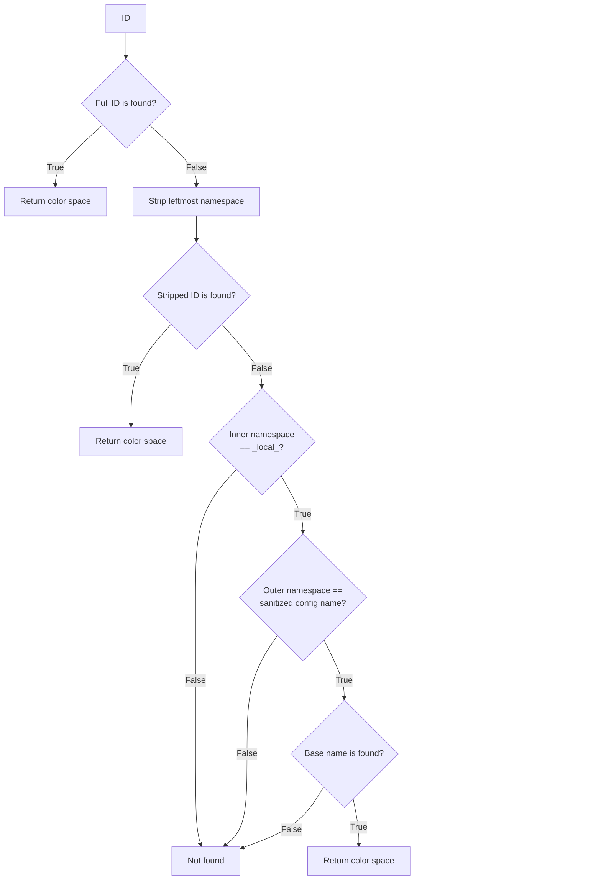

# An ID for Color Interop

**ASWF Color Interop Forum Recommendation**

*2026-06-14 draft – WORK-IN-PROGRESS*


## Introduction

During its lifecycle, a professionally produced image may travel through dozens of software tools, graphics APIs, and file formats, each with their own method for identifying color spaces. One of the goals of the Color Interop Forum is to help people translate between these different tagging methods by providing reference materials that may serve as a kind of "Rosetta Stone". In some cases, the tagging methods are hard-coded (e.g., a set of enumerated types in a graphics API), but in other cases a text string is used. This document provides guidance for how to set a color space name string for good interoperability, the result is called a ***color interop ID***.


## Color Space Name Strings

Unfortunately, it has been difficult to get the industry to coalesce around standard names for color spaces. The ACES project made the most concerted attempt at trying to make this happen but, despite their best efforts, even standard ACES color spaces are often referred to by a variety of different names (e.g., "ACES2065-1" vs. "lin\_ap0"). Often, VFX/animation studios or applications have long-standing practices concerning how to name color spaces and it is very difficult to make changes.

Part of the success of OpenColorIO is that it allows studios to name color spaces according to their own conventions and provides a configuration format to facilitate getting those names to show up in application software menus for artists. However, an OCIO color space name only has meaning within the self-contained universe of the configuration file in which it is defined and may be unrecognized by another config file. 

The Color Interop Forum has worked on developing a set of standardized names for common color spaces, but the challenges of reaching consensus required having two recommended strings:

1. A recommended user-facing name. This is what should be used in end-user menus, but it is only a recommendation, with the understanding that studios or applications may need to customize it to meet their own conventions.  
2. An "interop" ID string which is mandatory but not user-facing (i.e., it should only be used inside file formats and should never show up in end-user application menus). This is intended to be a fixed, permanent name.

In order to keep the string compact, and because the user-facing name is just a recommendation that may be overridden, only the interop ID is designed to be stored in file formats.

However, the Color Interop Forum only develops recommendations for the most common color spaces and there is a need to be able to generate a name string for any possible color space. To avoid the problem of different groups trying to use the same string for different color spaces, the proposal is that a "namespace" be used along with the color space name. That way, people may generate IDs for unique color spaces with minimal risk of colliding with IDs generated by others.

Rather than requiring two separate attributes in various file formats, the namespace and color space name are combined into one string.


## The Color Interop ID

Therefore, the color interop ID is structured as a base string and a namespace string, separated by a colon:
`<NAMESPACE>:<BASE>`

For example: 
`my-vfx-studio:custom_cinema_camera_a123`

If the base string is one of the Color Interop Forum IDs, the namespace and separator are not used. For example: `lin_rec709_scene`. This reduces the length of the ID for the common color spaces that represent the vast majority of use-cases. For other color spaces, the namespace is mandatory.

For maximum portability and robustness, the following restrictions are placed on the Interop ID:

1. It may only use lower-case ASCII characters: 0-9, a-z, and the following characters (no spaces):  
   `. - _ ~ / * # % ^ + ( ) [ ] |`
2. A colon ":" may only be used as a separator.  
3. If the color space is not part of an official Color Interop Forum recommendation, the namespace must be present.

The namespace is further broken down into two parts, the inner and outer namespace, so the detailed structure is:
`<OUTER_NAMESPACE>:<INNER_NAMESPACE>:<BASE>`

Allowing the namespace to have two parts provides useful flexibility in how IDs are used. When searching for an interop ID, if the initial search does not return a match, a color management system may drop the leftmost namespace and search again. If the outer namespace is not present, the inner namespace is essentially a soft qualifier that may be dropped if necessary. Here are a few examples of how that is useful:

* A cinema camera vendor could use an ID such as `acme_camera:acmelog_acmegamut_scene`. If `acmelog_acmegamut_scene` later becomes an official Color Interop Forum color space, any media files containing `acme_camera:acmelog_acmegamut_scene` would be handled as equivalent to those containing only `acmelog_acmegamut_scene`.
* A VFX studio might have a slightly customized version of one of the common Color Interop Forum color spaces. They could tag media with `super_vfx:g22_rec709_scene` and within their own pipeline it would match their own implementation. However, if they send files elsewhere, the color management would fall back to the standard `g22_rec709_scene`.

Using the outer namespace will limit the extent to which a color management system will fall back, since only the leftmost namespace is dropped. For example, an animation studio could use the ID `show_name:studio_name:our-rendering-space` and if the color management system was unable to match the full ID, it would try `studio_name:our-rendering-space`. In other words, a studio-wide default could be substituted for a show-specific variant. However, this would never match only the base `our-rendering-space`.

An ID is allowed to leave either the inner or outer namespace blank (or both, if the base is an official Color Interop Forum color space). Separators are only included if there are characters to the left. Note that when the leftmost namespace is stripped, it takes only one separator with it. For example, `my-studio::srgb` is a legal ID, and when the leftmost namespace is stripped, it leaves `:srgb`, which would not match `srgb`.

The ID syntax supports an additional scenario: the ability to define an ID that should be interpreted only in the context of a specific color configuration. This is allowed by setting the outer namespace to the name of the configuration and setting the inner namespace to the special token `local`. For example, for the ID `show1-config:local:srgb`, the color management system first checks the name of the configuration and, only if it is `show1-config`, it then searches that config for the base name `srgb`. This makes it possible for applications to generate interop IDs in a way that minimizes the possibility of collision with other IDs since they are only used locally within a specific configuration. In other words, this example would not match `srgb` in another color configuration. When using OCIO, it is important to set the `name` attribute (within the config file) to something that is unlikely to conflict with other configs, since that is what will be used as the outer namespace.

Annex B contains a more precise, parser oriented, description of the ID syntax. 

When building IDs from strings that may come from elsewhere, such as the name of a config file or the name of a color space, keep in mind that the strings must be "sanitized" so that they only contain the allowed characters. The sanitization must be done not only when creating the ID, but also when searching within the color management configuration for local config or color space names. Annex C specifies the algorithm for sanitizing strings. It's important that all implementations use the same algorithm for this so that the IDs are fully interoperable.

Figure 1  This flowchart illustrates how a color management system should search its library of color spaces (e.g., a config file in the case of OCIO) for a matching ID.



### Avoiding Naming Collisions

When generating interop IDs, it is essential to avoid using the same string that may be used by others. A Wiki has been set up on the Color Interop Forum GitHub site to allow entities to reserve namespaces or IDs to avoid collisions with other users. 

For example, a namespace consisting of "ocio", or any string beginning with "ocio", is reserved for use by the OCIO project maintainers.

Please see Annex A for more information about the interop ID registry.

### Uniqueness of the Interop ID

A color interop ID is intended to be an unambiguous identifier that may be used to match up color spaces that are functionally equivalent. It is not a "unique ID" in the sense that it is not intended to be unique to a specific color space implementation, for example, in a specific OCIO config. If color spaces in two configs share an interop ID, it does not imply that a hash function such as a config or processor ID of the two would also be identical. In the case of OCIO color spaces, for example, the bit-depth or other attributes may differ, a different reference space may be used, one may use an analytic log or exponent transform and the other may use a LUT, or other such differences may be present.

In addition, the ID is not necessarily intended to capture every detail of how colors arrive in a given color space. For example, as long as colors are intended to be viewed on a Rec.709 monitor, it is likely correct to assign the `g24_rec709_display` ID, regardless of what look or view transform was used in the conversion. However, it is always possible to generate a new ID to capture certain details, if it is felt essential to do so.


## Using the Color Interop ID in Color Management Systems

The purpose of the color interop ID is to define a mechanism that allows many different participants to refer to color spaces in a standardized way both across individual color configurations and across products and color management systems. In practice, this means that when an application encounters an asset tagged with an ID, it will be able to ask the color management system to resolve the ID to a specific color space transform implementation.

The Color Interop Forum recommendations provide essential information about common color spaces along with the color interop ID string. This includes references to source documents, clarification of confusing topics, and an OpenColorIO config implementation. Since OCIO is open source, the config may be used to understand the exact math involved in implementing a given color space and connecting it to other color spaces. It is therefore hoped that these recommendations will be useful and enable good interoperability for the associated IDs, regardless of whether OCIO is used in a given implementation.


## Using the Color Interop ID with OpenColorIO

Since OpenColorIO is open source, providing details on that implementation may be useful to those looking to implement support for the color interop ID, as well as to OCIO users.

As of OCIO 2.5, released in September 2025, there is an `interop_id` attribute available for use on ColorSpace objects in an OCIO config file. This allows config authors to set the appropriate interop ID on their color spaces. (It is legal to write this for config file versions going back to 2.0 without preventing the config from being read by earlier versions of OCIO.)

Note that the color space's `interop_id` is what is used to get the ID an application should write into a file format. However, it is not used when searching a config for an interop ID. 

Unlike the strings used for color space names and aliases, an interop ID may appear more than once in a config. This is because configs sometimes contain color spaces that are essentially identical but that may, for example, include different look or color balance adjustments which don't affect how it should be handled. Therefore, when searching for an interop ID, it is the color space names and aliases that must be searched, rather than looking for the `interop_id` attribute itself. That way, the config author decides which color space takes precedence if several share the same ID.

Searching uses the usual `Config::getColorSpace` function. For that purpose, it is essential that config authors set the interop ID as an alias on the color space. (The `ociocheck` command-line tool verifies that this is the case.)

There are three basic tasks an application may want to perform: 
1. Getting an ID to write to a file format to reference a color space in a config
2. Searching a config for the color space that implements an ID
3. Getting the user-facing name for an ID

### Getting an ID for a Color Space

When an application needs an interop ID for a color space, for example, to use when writing to a file format, the following steps should be used:

1. Call the function `ColorSpace::getInteropID()` to see if the config author has already provided the interop ID (this is the ideal scenario).
2. Instantiate a built-in Studio config using `Config::CreateFromBuiltinConfig("studio-config-latest")`, then use it with `Config::LocateBuiltinColorSpace(srcConfig, srcColorSpaceName, builtinConfig)` which will try to locate the equivalent color space implementation in the Studio config. Since all of the built-in color spaces have an interop ID set, you may then use `getInteropID()` on the resulting color space, if one is found.
3. You may ask OCIO to generate an ID that will be local to that config using the function `Config::generateLocalIDForColorSpace(srcColorSpaceName)`. Note that this will only succeed if `Config::getName()` returns a non-empty string.

It's possible that none of the above steps will yield an interop ID. In that case, the application should either not write the interop ID in the file format, or it should write the ID "unknown". It should *never* write a default color space that may or may not correspond to the actual color space, as this will cause a loss of trust in the system.

### Searching a Config for an ID

When an application receives an ID, for example when reading from a file format, it should use the following steps to find a matching color space:

1. Call the function `Config::findColorSpaceForID(idString)` which will search the config to find a color space whose name or one of its aliases match the ID. This function implements the various fall backs described above such as stripping the leftmost namespace and verifying the config name, if the ID requests a local match.
2. The application may instantiate the latest built-in Studio config and call `findColorSpaceForID` on that. The latest version of this config implements support for all Color Interop Forum recommended color spaces that have been published at the time a given OCIO library is released.

If no interop ID is found in step 1, the application may want to provide special handling for the utility interop IDs "data", "unknown", and "bypass" based on the descriptions in the "Color Space Encodings for Texture Assets and CG Rendering" recommendation.

If the color space is located in step 2, an application has several alternatives in order to use a color space from a built-in config with a user's config:

* The function `Config::IdentifyBuiltinColorSpace` may be used to see if there is an equivalent color space in the user's config that simply uses a different name (e.g., it's named "lin_ap0" rather than "ACES2065-1", but it's the same mathematical transform).  
* The function `Config::GetProcessorFromConfigs` may be used to convert an image into one of the color spaces in the user's config (e.g., a working color space or a display color space).  
* The function `MergeColorSpaceFromConfig` may be used to merge the color space into the user's config. Generally, this should only be done to the in-memory version of the config rather than actually updating the user's config file on disk.

### Obtaining the User-Facing Name from the Interop ID

The interop ID should not be shown in the user interface, for example in color space menus. The ID should first be used to find a `ColorSpace` object, then call `getName` on the object to obtain the user-facing string that should be used in the UI.


## Annexes

### Annex A: Registering Interop IDs

A Wiki has been created on the Color Interop Forum's GitHub repo to allow people to register interop IDs they generate and namespaces. This is intended to help avoid conflicts by providing visibility into how others are using the system. 

The Wiki page is available at this [URL](https://github.com/AcademySoftwareFoundation/ColorInterop/wiki/Registered-Color-Interop-IDs).

Not everyone will have write access to the Wiki. To have something added to the registry, please post a request on the ASWF Slack in the \#color-interop-forum channel, create an Issue on GitHub or send a message to one of the Color Interop Forum leaders.


### Annex B: Interop ID Syntax

The grammar is expressed in ABNF notation per [RFC 5234](https://www.rfc-editor.org/rfc/rfc5234). It operates on the ASCII character set. Strings containing non-ASCII characters must first be sanitized per Annex C before use as an interop ID.

```abnf
interop-id  = base-id
            / inner-ns ":" base-id
            / outer-ns ":" inner-ns ":" base-id
            / outer-ns ":" ":" base-id

outer-ns    = id-token
inner-ns    = id-token   ; "local" is semantically reserved (see above)
base-id     = id-token

id-token    = 1*id-char

id-char     = lc-alpha / DIGIT
            / "." / "-" / "_" / "~" / "/"
            / "*" / "#" / "%" / "^" / "+"
            / "(" / ")" / "[" / "]" / "|"

lc-alpha    = %x61-7A   ; a-z only — uppercase is not permitted
DIGIT       = %x30-39   ; 0-9
```


### Annex C: Sanitizing Name Strings for Interop ID Usage

All implementations of interop IDs must use the same method. Here is Python code to illustrate the algorithm:

```python
def sanitizeIDToken(s: str) -> str:
    ALLOWED = frozenset('abcdefghijklmnopqrstuvwxyz0123456789.-_~/*#%^+()[]|')

    EXPLICIT = {
        ' ':  '_',
        '\t': '_',
        '\n': '_',
        '\r': '_',
        '{':  '(',
        '}':  ')',
        '<':  '(',
        '>':  ')',
        ',':  '.',
        ';':  '|',
        ':':  '|',
        "'":  '#',
        '"':  '#',
        '\\': '/',
    }

    result = []
    for char in s:
        if ord(char) > 127:
            result.append('^')
            continue

        if char in EXPLICIT:
            result.append(EXPLICIT[char])
        elif char in ALLOWED:
            result.append(char)
        elif char.isupper():
            result.append(char.lower())
        else:
            result.append('*')

    return ''.join(result)
```

## General References

Color Interop Forum Recommendation ["Identifying the Color Space of OpenEXR Files"](https://github.com/AcademySoftwareFoundation/ColorInterop/blob/main/Recommendations/04_OpenEXRFiles/OpenEXRFiles.md)

OpenEXR Standard Attribute [colorInteropID](https://openexr.com/en/latest/StandardAttributes.html#anticipated-use-in-pipeline)

Color Interop Forum Recommendation ["Color Space Encodings for Texture Assets and CG Rendering"](https://github.com/AcademySoftwareFoundation/ColorInterop/blob/main/Recommendations/01_TextureAssetColorSpaces/TextureAssetColorSpaces.md) 

Color Interop Forum Recommendation ["Color Space Encodings for Displays"](https://github.com/AcademySoftwareFoundation/ColorInterop/blob/main/Recommendations/02_DisplayColorSpaces/DisplayColorSpaces.md)

[OpenColorIO](https://opencolorio.org/)

