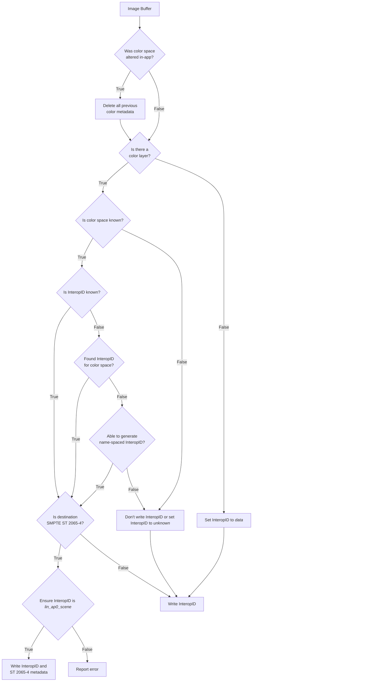
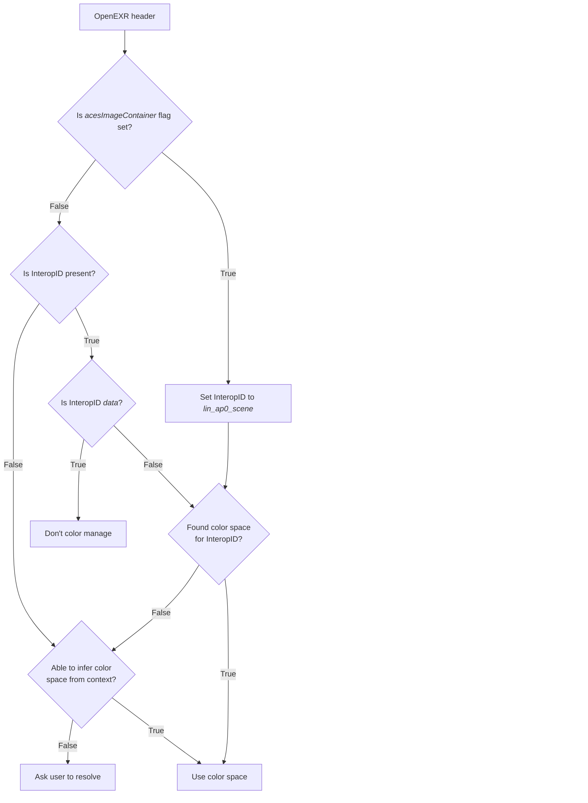

## Identifying the Color Space of OpenEXR Files

**ASWF Color Interop Forum Recommendation**

*2026-07-14 v1.0.0*

### Introduction

This recommendation aims to improve the reliability of tagging an OpenEXR file to identify what color space it contains. It attempts to do so via the following:

* Supplanting the chromaticities attribute with a standard color space ID string.
* Providing guidance to application developers about how to handle color space tagging.

### Motivation

There is a widespread perception that color space metadata in OpenEXR files is unreliable. This is due to a number of factors, including:

* Applications sometimes set the chromaticities to a default value (e.g. linear Rec.709) without knowing if that is actually what the file contains.
* Applications sometimes inappropriately forward color space metadata from one version of a file to another even if the processing changed the color space.
* Many studios and application vendors have moved from using the chromaticities attribute to a proprietary color space name string attribute which is only understood within a given pipeline or application.

The [chromaticities attribute](https://openexr.com/en/latest/StandardAttributes.html#encoded-image-color-characteristics) that has been available for many years in the OpenEXR format is an elegant and flexible method of identifying a (linear) color space. However, many studios and application vendors have moved to using a color space name string instead for reasons that include:

* A color space name string is easier for end-users to interpret than a set of eight floating point numbers.  
* Color management systems such as OpenColorIO (which is widely adopted in the entertainment industry) have encouraged the use of a name string to represent a color space and many studio pipelines are built around that representation.

After a lot of discussion in the Color Interop Forum meetings and the OpenEXR and OCIO steering committees, the conclusion was that trust in chromaticities has been broken and that there should be an effort to agree on a standard attribute based on a color space name string.

Having a standard attribute name is critical since that will enable applications to avoid forwarding it (unmodified) when they change the color space of an image, rather than just passing it along with all the other attributes in the OpenEXR header.

### Introducing the Color Interop ID

The color interop ID is a related Color Interop Forum Recommendation for a standardized string that is suitable for use in file formats such as OpenEXR. It consists of two parts: a color space name and a namespace used to disambiguate the name. Please refer to the [Color Interop ID Recommendation](https://github.com/AcademySoftwareFoundation/ColorInterop/blob/main/Recommendations/03_ColorInteropID/ColorInteropID.md) for the details.

The OpenEXR attribute name for the color interop ID is: `colorInteropID` and it is of type "string".

### Multi-channel, Multi-layer, and Multi-part Files

Images in OpenEXR files typically contain multiple channels and each channel has its own name. Channel names often have an "R", "G", or "B" suffix used for color images but may alternatively have a suffix indicating alpha, Z-depth, normals, object IDs, or other specialized channels (sometimes known as "AOVs"). The `colorInteropID` is intended to specify the color space of the pixels formed by combining the R, G, and B channels. Note that an alpha channel represents fractional coverage, does not have a color space, and should not be color managed. And obviously, Z-depth and other data channels should not be color managed. 

Unfortunately, sometimes non-color channels (e.g., normals or IDs) are labelled with an "R", "G", or "B" suffix in order to work around limitations in application software that cannot properly handle data channels. This is problematic since it means that applications that are properly color managed may need to provide some UI to allow users to disable color management on what are incorrectly labelled as RGB images.

In OpenEXR terminology, a file may contain multiple "layers" where each layer is a multi-channel image. For example, a renderer might emit a file that includes a "beauty" layer of the overall render along with layers for multiple lighting passes that are useful during compositing. Similarly, it may also contain multiple "views", for example, left and right images for stereo-3D. 

Furthermore, the contents of an OpenEXR file may be split into multiple "parts". This is typically done for performance reasons so that each part may be compressed differently or stored in a more optimal memory layout for rapid access. [Each part has its own header](https://openexr.com/en/latest/OpenEXRFileLayout.html#multi-part-file-new-in-2-0) but, by convention, the first part's metadata refers to the entire file, and other parts' metadata applies only to that part.

It is strongly recommended that color images in all parts in a single file be in the same color space. Therefore, the `colorInteropID` need only be set in the first header.

Within a part, all RGB image layers and views are considered to be in the same color space, as defined by the interop ID. If an "R", "G", or "B" suffix must be used to define a layer that is not a color image (e.g., normals or IDs), it is recommended that those layers be put in a separate part of the OpenEXR file where the `colorInteropID` in its header is set to "data".

The header of an OpenEXR file may contain a [preview image](https://openexr.com/en/latest/ReadingAndWritingImageFiles.html#preview-images) (i.e., a thumbnail). These are low resolution eight-bit, gamma-corrected images stored entirely in the header. The color space of these images is unspecified but typically it will be different from the color specified by the color interop ID.

### Writing OpenEXR Files

Application developers are urged to follow these steps when writing an OpenEXR file in order to ensure reliable color space metadata:

1. If the color space of an image is not known, do not "guess" or use a default color space such as `lin_rec709_scene`. Either omit the `colorInteropID`, or set it to `unknown`.  
2. When copying the header metadata from a source image, do not simply forward the `colorInteropID` unless it is known that the processing did not change the color space. Similarly, do not forward other known color metadata such as `acesImageContainer` and the chromaticities if they are no longer valid.  
3. If there are no RGB images that should be color managed, set the `colorInteropID` to `data`.  
4. If the color space is ACES2065-1 and the intent is to write a SMPTE ST 2065-4 compliant file, the `colorInteropID` `lin_ap0_scene` should be set in addition to the metadata specified in ST 2065-4.  
5. If an OCIO color space for the image is available, please see the [Color Interop ID Recommendation](https://github.com/AcademySoftwareFoundation/ColorInterop/blob/main/Recommendations/03_ColorInteropID/ColorInteropID.md) for details on how to obtain the interop ID and write the `colorInteropID` accordingly.  
6. If a color management system other than OCIO is being used, consult the Color Interop Forum Recommendations to find the interop ID for the color space. If the color space is known but not present there, you may generate an interop ID with an appropriate namespace. The [OCIO Studio config for ACES](https://github.com/AcademySoftwareFoundation/OpenColorIO-Config-ACES/releases) is a good source of color space names and interop IDs that would be recognized in a wide variety of applications.

Other than for ST 2065-4 compliance, it is recommended that the chromaticities attribute not be set when setting the `colorInteropID`. This is to avoid the confusion that may result due to more than one color space attribute being present. 

Application and pipeline developers are encouraged to migrate to the `colorInteropID` from any proprietary color space metadata they may be using. This is important since if the file is edited by another application, it won't be aware that the proprietary attribute should be deleted if the color space is modified.

Figure 1 provides a flow chart for setting the `colorInteropID`. 

##### Figure 1: Recommended steps when writing OpenEXR files.

### Reading OpenEXR Files

Application developers are urged to follow these steps when reading an OpenEXR file in order to ensure reliable color management:

1. If the `acesImageContainer` attribute is present, this takes precedence, consider the color space ACES2065-1. This should be handled the same as if the `colorInteropID` is present and set to `lin_ap0_scene`.  
2. If the `colorInteropID` is `data`, the images should not be color managed. (With OCIO, this may be accomplished by assigning the `data` role or color space, if present, or another color space where isData is true.) If the interop ID was in the header for the first part of a multi-part file, `data` applies to the whole file. Otherwise, it applies only to the images in that part.
3. Attempt to map the `colorInteropID` to a color space supported by the color management system being used. Please see the [Color Interop ID Recommendation](https://github.com/AcademySoftwareFoundation/ColorInterop/blob/main/Recommendations/03_ColorInteropID/ColorInteropID.md) for details on how to use the ID with a color management system.  
4. If the `colorInteropID` is not present, or a usable color space cannot be identified from it (e.g., it is not recognized by the user's OCIO config), then the application may fall back to some other mechanism of assigning a color space, or ask the user to choose a color space for the image.

In step three, if the color management system was unable to find a color space for the interop ID, that is an error condition that should ideally be surfaced to the end-user. However, the ID `unknown` is a special case that need not be considered an error, an application could proceed directly with its fallback (e.g., with OCIO, the File Rules could be used to assign a color space based on the path name of the file).

In a multi-part file, the `colorInteropID` in the first part should describe the color space of all RGB images in the file. The only case where another part should define the `colorInteropID` is for a part where all the layers are data. Applications are not required to support the case where the `colorInteropID` in the header for a later part is not `data`.

Because the chromaticities attribute is often unreliable, applications will need to judge whether to use this as a potential fallback. For example, if the `colorInteropID` is missing but the chromaticities attribute is present.

Note that in some scenarios the color space may be specified by some other mechanism that has higher priority in a given pipeline. For example, if an OpenEXR file is loaded as a texture from an OpenUSD or MaterialX file, the color space attribute specified there normally takes precedence over metadata in the OpenEXR header. Similarly, an ACES Metadata File (AMF) that accompanies a directory of OpenEXR files normally takes precedence. In other cases, a color space name may be embedded in the file name or path. 

Finally, it's important that applications give the artist/user the ability to override the color space to deal with incorrectly tagged files.

Figure 2 provides a flow chart for assigning a color space based on the header. Please note that if the channel name does not end in ".R", ".G", or ".B", it is not part of a color image and should be handled as data.

##### Figure 2: Recommended steps when reading OpenEXR files.

## General References

Color Interop Forum Recommendation ["An ID for Color Interop"](https://github.com/AcademySoftwareFoundation/ColorInterop/blob/main/Recommendations/03_ColorInteropID/ColorInteropID.md)

Color Interop Forum Recommendation ["Color Space Encodings for Texture Assets and CG Rendering"](https://github.com/AcademySoftwareFoundation/ColorInterop/blob/main/Recommendations/01_TextureAssetColorSpaces/TextureAssetColorSpaces.md) 

Color Interop Forum Recommendation ["Color Space Encodings for Displays"](https://github.com/AcademySoftwareFoundation/ColorInterop/blob/main/Recommendations/02_DisplayColorSpaces/DisplayColorSpaces.md)

OpenEXR Standard Attribute [colorInteropID](https://openexr.com/en/latest/StandardAttributes.html#anticipated-use-in-pipeline)

[ACES Technical Documentation](https://docs.acescentral.com/)

[“SMPTE ST 2065-4:2023 – ACES Image Container File Layout”](https://pub.smpte.org/pub/st2065-4/st2065-4-2023.pdf) Society of Motion Picture and Television Engineers, New York, US, Standard, 2023

[OpenColorIO](https://opencolorio.org/)

## Annexes

### Annex A: Chromaticities Compatibility

This table may be useful for mapping an OpenEXR `chromaticities` attribute to the corresponding `colorInteropID` attribute for common color spaces. The tolerance for comparing floating-point values should be approximately \+/- 0.001 in x and y.

| Color Interop ID | Red xy | Green xy | Blue xy | White xy |
| :---- | :---- | :---- | :---- | :---- |
| `lin_rec709_scene` | x: 0.640 y: 0.330 | x: 0.300 y: 0.600 | x: 0.150 y: 0.060 | x: 0.3127 y: 0.3290 |
| `lin_ap0_scene` | x: 0.7347 y: 0.2653 | x: 0.000 y: 1.000 | x: 0.0001 y: –0.0770 | x: 0.32168 y: 0.33767 |
| `lin_ap1_scene` | x: 0.713 y: 0.293 | x: 0.165 y: 0.830 | x: 0.128 y: 0.044 | x: 0.32168 y: 0.33767 |
| `lin_p3d65_scene` | x: 0.680 y: 0.320 | x: 0.265 y: 0.690 | x: 0.150 y: 0.060 | x: 0.3127 y: 0.3290 |
| `lin_rec2020_scene` | x: 0.708 y: 0.292 | x: 0.170 y: 0.797 | x: 0.131 y: 0.046 | x: 0.3127 y: 0.3290 |
| `lin_adobergb_scene` | x: 0.640 y: 0.330 | x: 0.210 y: 0.710 | x: 0.150 y: 0.060 | x: 0.3127 y: 0.3290 |
